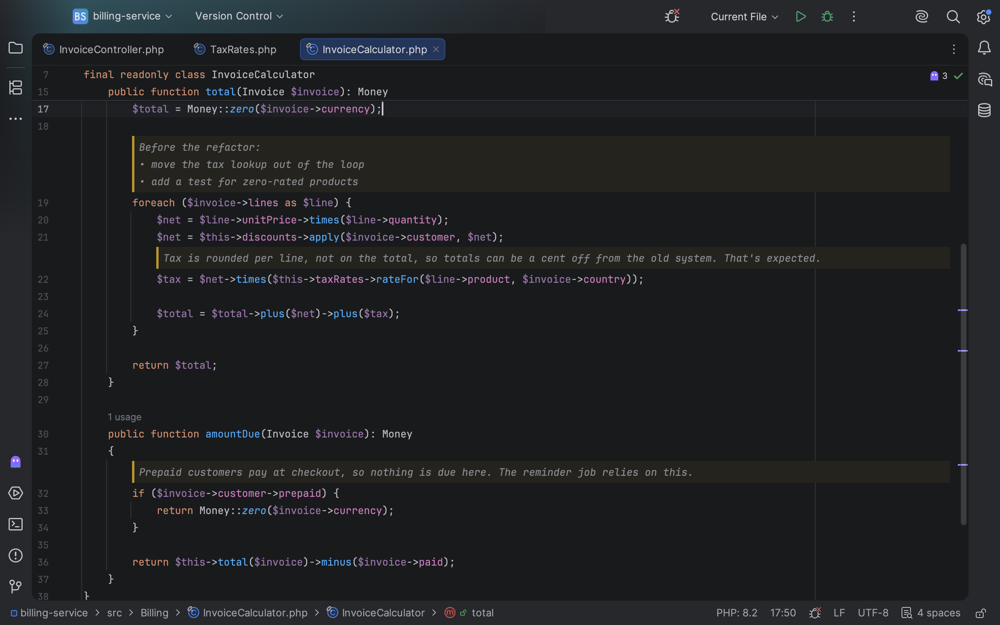
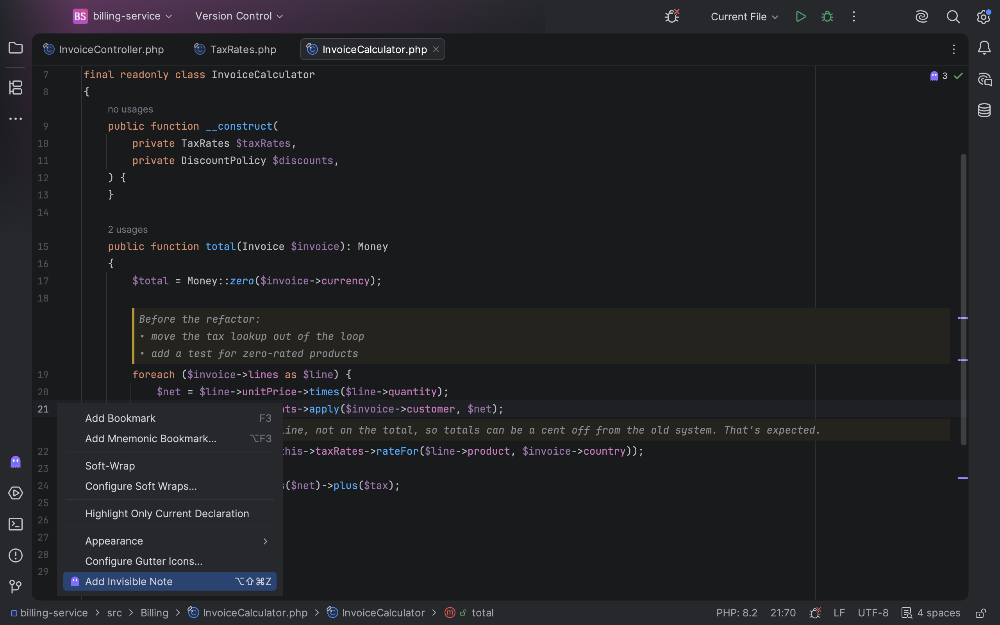
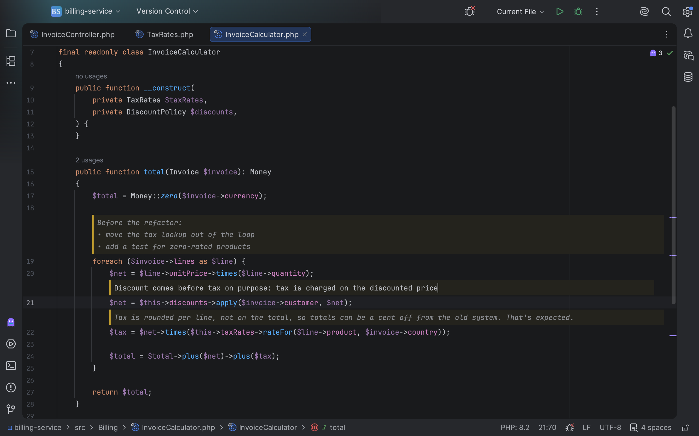
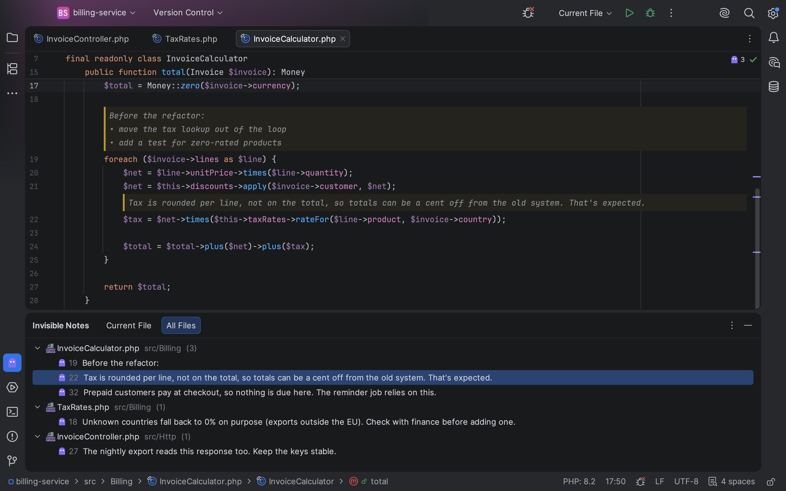

import { Card, CardGrid } from '@astrojs/starlight/components';

Invisible Notes shows your notes in the editor, between the lines of code, while the file itself stays untouched:
there is nothing to commit and nothing for version control to pick up. Use them to record what you worked out while
reading unfamiliar code, to leave yourself reminders, or to keep questions for later.

<video controls playsInline preload="metadata" poster="/invisible-notes/video/invisible-notes-poster.jpg" aria-label="Invisible Notes in PhpStorm: adding a note, notes following the code, finding and restoring notes">
	<source src="/invisible-notes/video/invisible-notes.mp4" type="video/mp4" />
	Your browser can't play this video. [Download it](/invisible-notes/video/invisible-notes.mp4) instead.
</video>

## What it does

<CardGrid>
	<Card title="Notes in the editor" icon="pencil">
		Right-click a line and choose **Add Invisible Note**, or press <kbd>Ctrl+Alt+Shift+Z</kbd>
		(<kbd>⌥⇧⌘Z</kbd> on macOS). The note appears above the line, and the file doesn't change.
	</Card>
	<Card title="Notes follow the code" icon="code-branch">
		A note stays with its line when you edit, reformat, pull changes or switch branches, and when files are
		renamed or moved.
	</Card>
	<Card title="See where the notes are" icon="magnifier">
		Each note has a mark next to the scrollbar, and the editor's top-right corner shows how many notes the file
		has.
	</Card>
	<Card title="All notes in one place" icon="list-format">
		The Invisible Notes tool window lists the notes of the current file or of the whole project. Click one to
		jump to it.
	</Card>
	<Card title="Delete them all at once" icon="close">
		Delete every note of a file, or of the whole project, in one step. You're asked first.
	</Card>
	<Card title="Undo" icon="approve-check">
		Deleted a note by mistake? Undo brings it back, like any other edit. That goes for deleting them all, too.
	</Card>
	<Card title="Notes for AI tools" icon="puzzle">
		An AI tool connected to your IDE can explain or review code by adding notes next to it, without changing
		your files. See [Notes for AI tools](/invisible-notes/guides/ai-tools/).
	</Card>
	<Card title="Stored on your computer" icon="padlock">
		Notes are kept locally, outside the project, and the plugin doesn't send them anywhere. Clearing the IDE
		caches doesn't remove them, and they stay with a project whose folder you move or rename.
	</Card>
</CardGrid>

## Take a look

## Try it

Invisible Notes is sold through JetBrains Marketplace, with a free 30-day trial. It works in PhpStorm 2025.2 and
newer, and in other JetBrains IDEs from version 2025.2. In 2025.1 you get version 1.0.0, which has the notes but
not what was added since.

<CardGrid>
	<Card title="Install it" icon="rocket">
		[Installation](/invisible-notes/getting-started/installation/) takes a minute, from inside the IDE.
	</Card>
	<Card title="Pricing and trial" icon="star">
		How the [trial and licenses](/invisible-notes/licensing/pricing/) work.
	</Card>
</CardGrid>
